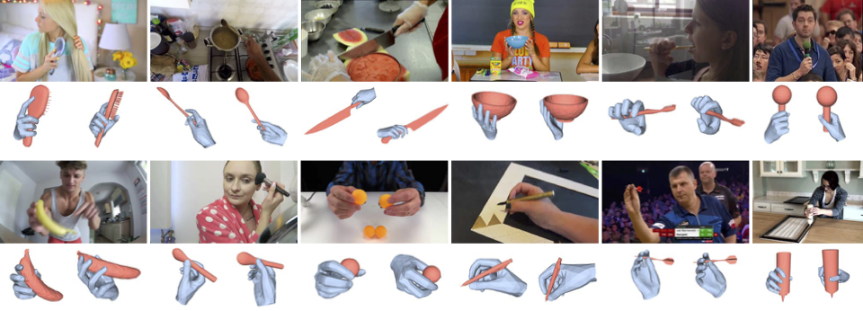

## <b>MOW dataset</b> [[Website]](https://people.eecs.berkeley.edu/~zhecao/rhoi/)

<div align=center>

</div>

This repository maintains our 3D dataset of humans Manipulating Objects in-the-Wild (MOW). The dataset contains 512 images in the wild, spanning 121 object categories with annotation of instance category, 3D object models, 3D hand pose, and object pose annotation. 

## Setup

### (0) Getting Started
Clone this repository, and create local environment with python3.6, and then run: `bash setup.sh`. Finally, download the MANO model following this [repo](https://github.com/otaheri/MANO).

### (1) Download the dataset

Download our data (512 examples) from this [link](https://people.eecs.berkeley.edu/~zhecao/rhoi/mow.zip).

### (2) Visualize the example
```bash

python vis_anno.py

```

## Citation

If you find this data useful in your research, please consider citing:

```latex
@InProceedings{Cao2021,
  title = {Reconstructing Hand-Object Interactions in the Wild},
  author = {Zhe Cao and Ilija Radosavovic and Angjoo Kanazawa and Jitendra Malik},
  booktitle = {ICCV},
  year = {2021}
}
```